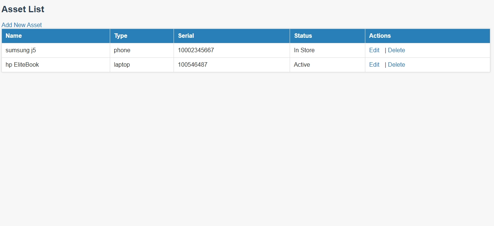
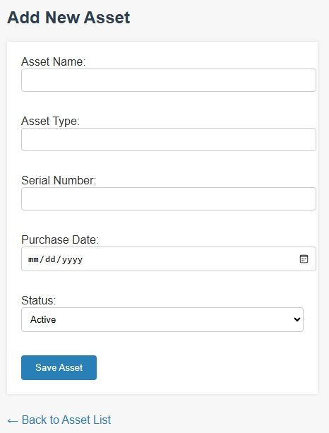
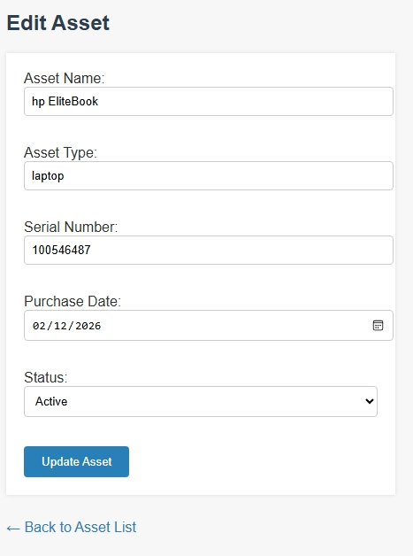

# Simple Asset Management System

A basic PHP & MySQL web application for managing organizational assets.

## Features
- Add assets
- View asset list
- Edit asset details
- Delete assets

## Technologies Used
- PHP
- MySQL
- HTML
- CSS

## Screenshots

### Asset List

### Add Asset

### Edit Asset

## Purpose
This project was developed to demonstrate practical skills in
PHP programming, database design, and information systems development.

## Author
Precious Thom
